Introduction
============

Presented here is an in-depth dive into the data analysis and Bayesian estimation technique used in my and Dr. Stallings study which builds off my honors thesis. The aim of the study was to analyze the mediatory function of Executive Functions on the relationship of Child Maltreatment and adult mental health. This project was my introduction into r, coding, and data analysis, so a lot was learned along the way. This vignette is not supposed to replace a publication and outline the literature setting up this study nor dive into the conclusions. Rather, it will display the code used in cleaning, visualizing, and modifying the data for analysis; explain what Bayesian estimation is and why it was used; and display specific results and their interpretation. For the preprint of the study, which is my honors thesis and was pre- use of Bayesian estimation, see the citation (Kent, 2020).

The data used in the study came from the Genetics for Antisocial and Drug Dependence (GADD) study conducted, in part, by the Institute for Behavioral Genetics at CU Boulder. GADD data were acquired in Denver, with subjects being representative of the Colorado front range. Measures of Child Abuse and Neglect (CAN), mental health (MH), and executive functions (EFs; synonymous with cognitive abilities) were chosen to answer two research questions: Does CT influence a change in EFs that in turn affect MH so that EFs mediate the relationship of CT and MH? And does measuring CT as different types of abuse and neglect (neglect, emotional, physical, and sexual abuse) show different individual predictions for each type of maltreatment on EFs and MH?

The original plan to analyze the data
-------------------------------------

Before I began analyzing the GADD data, my adviser, Dr. Michael Stallings, and I decided that we would conduct a longitudinal mediation analysis where CT predicted MH at three waves of data (three consecutive measurement times; mean age 16, 21, and 26) and where CT predicted EFs at two waves of data. I was to conduct Exploratory Factor analyses and subsequent Confirmatory Factor Analyses to find how the measures of CT, MH, and EFs loaded onto their respective factors. This would be used to create a structural equation model which would be the basis of my mediation analysis. The factors and subsequent structural equation model used in this model will be more clear when I discuss the results.

Data compiling and cleaning
===========================

The data was split into six data sets. Each data set had various relevant variables at different time points and they all required cleaning, concatenating, and merging. I was tasked with boiling down these data sets into a single data frame that could be used for analysis.

Gathering the main variables
----------------------------

Here's a snippet of my code to concatenate and gather all the variables used in my study. Press the drop down button on the right to display the code.

``` r
# acquisition and concatination of the GADD data
library(dplyr)
library(memisc)
library(Hmisc)
library(tidyr)
library(psych)
library(data.table)
library(psych)
library(tidyverse)
library(readxl)
library(writexl)
library(haven)
library(sjlabelled)

##### loading data and getting base variables #####

gaddw1 <- remove_all_labels(as.data.table(read_por('/Users/kylekent/Desktop/school/Honors thesis research/raw data/Wave1Q.por')))
gaddw2 <- remove_all_labels(as.data.table(read_por("~/Desktop/school/Honors thesis research/raw data/CombinedQs.por")))
neurocog.w1 <- remove_all_labels(as.data.table(read_por("~/Desktop/school/Honors thesis research/raw data/neurocog1.por")))
neurocog.w2 <- remove_all_labels(as.data.table(read_por("~/Desktop/school/Honors thesis research/raw data/neurocog2.por")))

colnames(gaddw1) <- tolower(colnames(gaddw1))
colnames(gaddw2) <- tolower(colnames(gaddw2))
#colnames(gaddw3) <- tolower(colnames(gaddw3))
colnames(neurocog.w1) <- tolower(colnames(neurocog.w1))
colnames(neurocog.w2) <- tolower(colnames(neurocog.w2))

gaddw1 <- as.data.table(gaddw1)
gaddw2 <- as.data.table(gaddw2)
neurocog.w1 <- as.data.table(neurocog.w1)
neurocog.w2 <- as.data.table(neurocog.w2)

# we have to detach these two packages since they mask dplyr::select() and are no longer needed
detach('package:memisc')
detach('package:MASS')

# isolate denver subjects using regular expressions and define variables (.us) at each wave that may be useful
  # we don't need iq measures yet
gaddw1.us <- select(gaddw1[!grepl('^.{3}S', nidaid),],
                    nidaid:nsex, clinical, hispanic:racecat, stroop1:trail4e, cesd1:cesd20)
gaddw2.us <- select(gaddw2[!grepl('^.{3}S', nidaid),], 
                    nidaid:testyr, clinical, gender, school:incsrce, cesd1:cesd20, cariq1:cariq20f)
neurocog.w1.us <- select(neurocog.w1[!grepl('^.{3}S', nidaid),],
                         nidaid:id, nage:nsex, testtype:w1cogsrc, w1strpwd:w1trlber)
neurocog.w2.us <- select(neurocog.w2[!grepl('^.{3}S', nidaid),],
                         nidaid:nage, w2strpwd:w2trlber)

# deleting duplicates - no duplicates for gaddw2 or neurocog.w1
gaddw1.us$duplicated <- gaddw1.us[,.(duplicated(nidaid))]
gaddw1.us[, .N, by = .(duplicated)]
gaddw1.us <- gaddw1.us[duplicated == FALSE]
gaddw1.us$duplicated <- NULL

neurocog.w2.us$duplicated <- neurocog.w2.us[,.(duplicated(nidaid))]
neurocog.w2.us[, .N, by = .(duplicated)]
neurocog.w2.us <- neurocog.w2.us[duplicated == F]
neurocog.w2.us$duplicated <- NULL

# changing all colnames to remove w1 prefix - this will be readded during merges - then change stroop and trail names
colnames(neurocog.w1.us) <- gsub('w1', '', colnames(neurocog.w1.us)) 
neurocog.w1.us <- dplyr::rename(neurocog.w1.us,
                                stroop1 = strpwd, stroop2 = strpco, stroop3 = strpcw,
                                trailA = trlatm, trailB = trlbtm)

colnames(neurocog.w2.us) <- gsub('w2', '', colnames(neurocog.w2.us))
neurocog.w2.us <- dplyr:: rename(neurocog.w2.us,
                                 stroop1 = strpwd, stroop2 = strpco, stroop3 = strpcw,
                                 trailA = trlatm, trailB = trlbtm)
# merge 'em
merged.gadd <- merge(gaddw1.us,gaddw2.us, by = "nidaid", suffixes = c('w1', 'w2')) 

merged.neuro <- merge(neurocog.w1.us, neurocog.w2.us ,by = "nidaid", suffixes = c('w1', 'w2'))

# merge previous data sets with the w1 neurocog data that has the hopfer subjects data
gadd.us <- as.data.table(merge.data.table(merged.gadd,
                                          merged.neuro,
                                          by = "nidaid"))

##### getting and scoring IQ data #####
neurocog.w2.agereference <- as.data.table(remove_all_labels(read_por("~/Desktop/school/Honors thesis research/raw data/neurocog2.por")))
# concatenating useful variables
Hop.iq <- select(neurocog.w1[!grepl('^.{3}S', nidaid), .SD], nidaid, 
                 w1wivoss, w1wiblss, w1wavoss, w1wablss, w1estiq,
                 w1wivorw, w1wiblrw, w1wavorw, w1wablrw)
Den.iq <- select(gaddw1[!grepl('^.{3}S', nidaid), .SD], nidaid, agew1 = age,
                 wavocab, wablockd, watsvoc, watsblck)
mergedw1 <- merge(Hop.iq, Den.iq, by = 'nidaid')

w2iq <- select(neurocog.w2[!grepl('^.{3}S', nidaid), .SD], nidaid, w2wsblss)
w2iq <- merge(w2iq, select(neurocog.w2.agereference[!grepl('^.{3}S', NIDAID)], NIDAID, agew2 = AGE), by.x = 'nidaid', by.y = 'NIDAID')
merged.iq <- merge(mergedw1, w2iq, by = 'nidaid')

# creating a key for which test was taken at w1 (no w2 because they all got WAIS)
merged.iq[!is.na(w1wivorw) & !is.na(w1wiblrw), iqtestw1 := 'WISC']
merged.iq[!is.na(w1wavorw) & !is.na(w1wavorw), iqtestw1 := 'WAIS']
merged.iq[grepl('^...D', nidaid) & !is.na(wavocab) & !is.na(wablockd), iqtestw1 := 'WAIS']

# coalescing raw scores into single variables
merged.iq[, `:=` (vocrww1 = coalesce(w1wivorw, wavocab),
                 blckrww1 = coalesce(w1wiblrw, wablockd))]

# coalescing the Hop scaled scores 
merged.iq[,`:=` (Hvocssw1 = coalesce(w1wivoss, w1wavoss),
                 Hblckssw1 = coalesce(w1wiblss, w1wablss))]

# creating a new dt of just scored variables
dt.iq <- select(merged.iq, nidaid, agew1, agew2,
                iqtestw1, Hvocssw1, Hblckssw1, watsvoc, watsblck, w1estiq, w2wsblss)

# checking dist and percentage dist of scored variables
quantile(dt.iq$Hvocssw1, probs = c(.02, .16, .5, .84, .98) , na.rm = T) # the scaled scores are definitely m = 10, sd = 3
quantile(dt.iq$Hblckssw1, probs = c(.02, .16, .5, .84, .98) , na.rm = T)

# converting scaled iq values (Hop) to t-scores then combining them with Den t-scores
dt.iq[,`:=` (HvocTw1 = round(((Hvocssw1 - 10)/3)*10+50, 1),
             HblckTw1 = round(((Hblckssw1 - 10)/3)*10+50, 1))]
dt.iq[,`:=` (vocTw1 = coalesce(HvocTw1, as.numeric(watsvoc)),
             blckTw1 = coalesce(HblckTw1, as.numeric(watsblck)))]

# merging IQ variables into gadd.us
gadd.us <- merge(gadd.us, 
              select(dt.iq, nidaid, agew1, agew2, iqtestw1, vocTw1, blckTw1, iqw1 = w1estiq, blckTw2 = w2wsblss), 
              by = 'nidaid')

##### getting MH variables #####
# load in measures of mental health from the first set dr. stallings gave me, it only included counts
gaddw2.MH <- as.data.frame(read_csv("~/Desktop/school/Honors thesis research/raw data/GADD2_DIS_MDD_GAD.csv"))
gaddw2.MH.us <- select(gaddw2.MH,
                       nidaid,
                       GADw2 = ga4csx, MDDw2 = dp4asx, DYSw2 = dy4bsx)

temp.gadd.us <- gadd.us
gadd.us <- merge(temp.gadd.us, gaddw2.MH.us,
                 by = "nidaid")

# loading in the DIS full datasets
gadd.DIS.w2 <- as.data.table(read_csv("~/Desktop/school/Honors thesis research/raw data/GADD2b_DIS.csv"))
gadd.DIS.w2.us <- select(gadd.DIS.w2,
                         nidaid,
                         GADw2.dx = ga4,
                         MDDw2.dx = dp4,
                         DYSw2.dx = dy4)

gadd.DIS.merge <- gadd.DIS.w2.us
gadd.DIS.merge <- with(gadd.DIS.merge, replace(gadd.DIS.merge, gadd.DIS.merge == 1, 0))
gadd.DIS.merge <- with(gadd.DIS.merge, replace(gadd.DIS.merge, gadd.DIS.merge == 5, 1))

temp.gadd.us <- gadd.us
gadd.us <- merge(temp.gadd.us, gadd.DIS.merge, by = "nidaid")

##### converting raw #####
# converting raw data into its usable form
#####
# reorder and rename all variables to be in order of wave and have the same name formatting
gadd <- select(gadd.us, 
               nidaid, agew1 = agew1.x, nagew1 = nagew1.x, nsex = nsexw1, hispanic = hispanic.x, proband,
               stroop1w1:trailBw1, iqtestw1, vocTw1, blckTw1, iqw1, blckTw2,
               cesd1w2:cesd20w2, GADw2:DYSw2.dx, stroop1w2:trailBw2, cariq1:cariq20f)
gadd.us$duplicated <- gadd.us[,.(duplicated(nidaid))]
gadd.us[, .N, by = .(duplicated)]
gadd.us <- gadd.us[duplicated == FALSE]
gadd.us$duplicated <- NULL
```

Here is a preview of the compiled data set. It has 694 subjects and 141 variables. As you can see, many of the variables have issues and need to be scored or cleaned further.

``` r
gadd[1:10]
```

    ##           nidaid agew1   nagew1 nsex hispanic proband stroop1w1 stroop2w1
    ##  1: 45-D11050331    15 15.52088    1        Y       0        78        52
    ##  2: 45-D11150341    17 17.25941    1        N       0        NA        NA
    ##  3: 45-D11170331    15 15.97810    1        N       0        87        67
    ##  4: 45-D11170341    14 14.43669    1        N       0        88        56
    ##  5: 45-D11180321    17 17.18001    1        Y       0        NA        NA
    ##  6: 45-D11180331    14 14.32991    1        Y       0        49        40
    ##  7: 45-D11220022    15 15.73990    0        N       1        97        97
    ##  8: 45-D11220311    18 18.01506    1        N       0       106        71
    ##  9: 45-D11240432    18 18.19302    0        N       0        NA        NA
    ## 10: 45-D11270422    17 17.24298    0        N       0        NA        NA
    ##     stroop3w1 trailAw1 trlaerw1 trailBw1 iqtestw1 vocTw1 blckTw1 iqw1 blckTw2
    ##  1:        35       22        0       69     WAIS     47      47   95      NA
    ##  2:        NA       NA       NA       NA     WAIS     43      62   NA      NA
    ##  3:        30       26        0       82     WAIS     39      31   78      NA
    ##  4:        38       16        0       87     WAIS     48      51   99      NA
    ##  5:        NA       NA       NA       NA     WAIS     32      44   NA      NA
    ##  6:        25       35        2      153     WAIS     41      42   86      NA
    ##  7:        59       20        0       46     WAIS     45      47   93      NA
    ##  8:        44       23        1       57     WAIS     50      53  102      NA
    ##  9:        NA       NA       NA       NA     WAIS     61      60   NA      NA
    ## 10:        NA       NA       NA       NA     WAIS     55      44   NA      NA
    ##     cesd1w2 cesd2w2 cesd3w2 cesd4w2 cesd5w2 cesd6w2 cesd7w2 cesd8w2 cesd9w2
    ##  1:       2       2       1       2       3       3       2       3       3
    ##  2:       0       0       0       1       0       0       0       0       0
    ##  3:       0       0       0       3       0       0       0       3       0
    ##  4:       0       0       0       3       0       0       0       3       0
    ##  5:       1       1       1       1       1       1       1       1       1
    ##  6:       0       0       0       0       0       0       0       0       0
    ##  7:       0       0       0       0       0       0       0       0       0
    ##  8:      NA      NA      NA      NA      NA      NA      NA      NA      NA
    ##  9:       1       0       0       2       0       0       1       1       0
    ## 10:       1       1       0       0       1       1       2       3       0
    ##     cesd10w2 cesd11w2 cesd12w2 cesd13w2 cesd14w2 cesd15w2 cesd16w2 cesd17w2
    ##  1:        2        2        2        2        2        2        2        0
    ##  2:        0        0        2        1        0        0        2        0
    ##  3:        0        1        3        0        0        0        3        0
    ##  4:        0        2        3        2        0        0        3        0
    ##  5:        0        2        2        2        1        1        0        0
    ##  6:        0        0        0        0        0        0        0        0
    ##  7:        0        0        3        0        0        0        3        0
    ##  8:       NA       NA       NA       NA       NA       NA       NA       NA
    ##  9:        1        0        2        0        0        1        2        0
    ## 10:        1        1        2        0        1        0        2        0
    ##     cesd18w2 cesd19w2 cesd20w2 GADw2 MDDw2 DYSw2 GADw2.dx MDDw2.dx DYSw2.dx
    ##  1:        2        2        2     6     0     0        0        0        0
    ##  2:        0        0        1     0     0     0        0        0        0
    ##  3:        0        0        0     0     0     0        0        0        0
    ##  4:        0        0        0     0     0     0        0        0        0
    ##  5:        0        0        0     0     1     4        0        0        0
    ##  6:        0        0        0     0     0     0        0        0        0
    ##  7:        0        0        0     0     0     0        0        0        0
    ##  8:       NA       NA       NA     0     0     0        0        0        0
    ##  9:        0        0        0     0     0     0        0        0        0
    ## 10:        0        0        0     2     5     0        0        1        0
    ##     stroop1w2 stroop2w2 stroop3w2 trailAw2 trlaerw2 trlast trlats trailBw2
    ##  1:        NA        NA        NA       NA       NA     NA     NA       NA
    ##  2:       100        75        41       20        0     12     53       47
    ##  3:        97        59        49       25        0     10     53      105
    ##  4:       109        86        58       19        0     13     55       53
    ##  5:        37        43        30       37        1      8     38       79
    ##  6:        67        52        34       28        0     10     53      196
    ##  7:       104        85        40       24        1     11     57       62
    ##  8:       124        64        40       14        1     16     71       38
    ##  9:        90        77        50       21        0     12     49       43
    ## 10:       103        77        51       20        0     12     49       38
    ##     cariq1 cariq1a cariq1b cariq1c cariq2 cariq2a cariq2b cariq2c cariq3
    ##  1:      0      NA      NA      NA      0      NA      NA      NA      0
    ##  2:      0      NA      NA      NA      0      NA      NA      NA      1
    ##  3:      0      NA      NA      NA      0      NA      NA      NA      0
    ##  4:      0      NA      NA      NA      0      NA      NA      NA      0
    ##  5:      0      NA      NA      NA      0      NA      NA      NA      0
    ##  6:      0      NA      NA      NA      0      NA      NA      NA      0
    ##  7:      0      NA      NA      NA      0      NA      NA      NA      0
    ##  8:      0      NA      NA      NA      0      NA      NA      NA      0
    ##  9:      0      NA      NA      NA      0      NA      NA      NA      0
    ## 10:      0      NA      NA      NA      0      NA      NA      NA      0
    ##     cariq3a cariq3b cariq3c cariq4 cariq4a cariq4b cariq4c cariq5 cariq5a
    ##  1:      NA      NA      NA      0      NA      NA      NA      1       8
    ##  2:       9      11       2      0      NA      NA      NA      0      NA
    ##  3:      NA      NA      NA      0      NA      NA      NA      0      NA
    ##  4:      NA      NA      NA      0      NA      NA      NA      0      NA
    ##  5:      NA      NA      NA      0      NA      NA      NA      0      NA
    ##  6:      NA      NA      NA      0      NA      NA      NA      0      NA
    ##  7:      NA      NA      NA      0      NA      NA      NA      0      NA
    ##  8:      NA      NA      NA      0      NA      NA      NA      0      NA
    ##  9:      NA      NA      NA      0      NA      NA      NA      0      NA
    ## 10:      NA      NA      NA      0      NA      NA      NA      0      NA
    ##     cariq5b cariq5c cariq6 cariq6a cariq6b cariq6c cariq7 cariq7a cariq7b
    ##  1:      10       3      0      NA      NA      NA      1       8      16
    ##  2:      NA      NA      0      NA      NA      NA      0      NA      NA
    ##  3:      NA      NA      0      NA      NA      NA      0      NA      NA
    ##  4:      NA      NA      0      NA      NA      NA      0      NA      NA
    ##  5:      NA      NA      0      NA      NA      NA      0      NA      NA
    ##  6:      NA      NA      0      NA      NA      NA      0      NA      NA
    ##  7:      NA      NA      0      NA      NA      NA      0      NA      NA
    ##  8:      NA      NA      0      NA      NA      NA      0      NA      NA
    ##  9:      NA      NA      0      NA      NA      NA      0      NA      NA
    ## 10:      NA      NA      0      NA      NA      NA      0      NA      NA
    ##     cariq7c cariq8 cariq8a cariq8b cariq8c cariq9 cariq9a cariq9b cariq9c
    ##  1:       2      0      NA      NA      NA      0      NA      NA      NA
    ##  2:      NA      0      NA      NA      NA      0      NA      NA      NA
    ##  3:      NA      0      NA      NA      NA      0      NA      NA      NA
    ##  4:      NA      0      NA      NA      NA      0      NA      NA      NA
    ##  5:      NA      0      NA      NA      NA      0      NA      NA      NA
    ##  6:      NA      0      NA      NA      NA      0      NA      NA      NA
    ##  7:      NA      0      NA      NA      NA      0      NA      NA      NA
    ##  8:      NA      0      NA      NA      NA      0      NA      NA      NA
    ##  9:      NA      0      NA      NA      NA      0      NA      NA      NA
    ## 10:      NA      0      NA      NA      NA      0      NA      NA      NA
    ##     cariq10 cariq10a cariq10b cariq10c cariq11 cariq11a cariq11b cariq11c
    ##  1:       0       NA       NA       NA       0       NA       NA       NA
    ##  2:       0       NA       NA       NA       0       NA       NA       NA
    ##  3:       0       NA       NA       NA       0       NA       NA       NA
    ##  4:       0       NA       NA       NA       0       NA       NA       NA
    ##  5:       0       NA       NA       NA       0       NA       NA       NA
    ##  6:       0       NA       NA       NA       0       NA       NA       NA
    ##  7:       0       NA       NA       NA       0       NA       NA       NA
    ##  8:       0       NA       NA       NA       0       NA       NA       NA
    ##  9:       0       NA       NA       NA       0       NA       NA       NA
    ## 10:       0       NA       NA       NA       0       NA       NA       NA
    ##     cariq12 cariq12a cariq12b cariq12c cariq13 cariq13a cariq13b cariq13c
    ##  1:       0       NA       NA       NA       0       NA       NA       NA
    ##  2:       0       NA       NA       NA       0       NA       NA       NA
    ##  3:       0       NA       NA       NA       0       NA       NA       NA
    ##  4:       0       NA       NA       NA       0       NA       NA       NA
    ##  5:       0       NA       NA       NA       0       NA       NA       NA
    ##  6:       0       NA       NA       NA       0       NA       NA       NA
    ##  7:       0       NA       NA       NA       0       NA       NA       NA
    ##  8:       0       NA       NA       NA       0       NA       NA       NA
    ##  9:       0       NA       NA       NA       0       NA       NA       NA
    ## 10:       0       NA       NA       NA       0       NA       NA       NA
    ##     cariq14 cariq14a cariq14b cariq14c cariq15 cariq15a cariq15b cariq15c
    ##  1:       0       NA       NA       NA       0       NA       NA       NA
    ##  2:       0       NA       NA       NA       0       NA       NA       NA
    ##  3:       0       NA       NA       NA       0       NA       NA       NA
    ##  4:       0       NA       NA       NA       0       NA       NA       NA
    ##  5:       0       NA       NA       NA       0       NA       NA       NA
    ##  6:       0       NA       NA       NA       0       NA       NA       NA
    ##  7:       0       NA       NA       NA       0       NA       NA       NA
    ##  8:       0       NA       NA       NA       0       NA       NA       NA
    ##  9:       0       NA       NA       NA       0       NA       NA       NA
    ## 10:       0       NA       NA       NA       0       NA       NA       NA
    ##     cariq16 cariq16a cariq16b cariq16c cariq16d cariq16e cariq16f cariq17
    ##  1:       0       NA       NA       NA                                  0
    ##  2:       0       NA       NA       NA                                  0
    ##  3:       0       NA       NA       NA                                  0
    ##  4:       0       NA       NA       NA                                  0
    ##  5:       0       NA       NA       NA                                  0
    ##  6:       0       NA       NA       NA                                  0
    ##  7:       0       NA       NA       NA                                  0
    ##  8:       0       NA       NA       NA                                  0
    ##  9:       0       NA       NA       NA                                  0
    ## 10:       0       NA       NA       NA                                  0
    ##     cariq17a cariq17b cariq17c cariq17d cariq17e cariq17f cariq18 cariq18a
    ##  1:       NA       NA       NA                                  0       NA
    ##  2:       NA       NA       NA                                  0       NA
    ##  3:       NA       NA       NA                                  0       NA
    ##  4:       NA       NA       NA                                  0       NA
    ##  5:       NA       NA       NA                                  0       NA
    ##  6:       NA       NA       NA                                 NA       NA
    ##  7:       NA       NA       NA                                  1        9
    ##  8:       NA       NA       NA                                  0       NA
    ##  9:       NA       NA       NA                                  0       NA
    ## 10:       NA       NA       NA                                  0       NA
    ##     cariq18b cariq18c cariq18d cariq18e cariq18f cariq19 cariq19a cariq19b
    ##  1:       NA       NA                                  0       NA       NA
    ##  2:       NA       NA                                  0       NA       NA
    ##  3:       NA       NA                                  0       NA       NA
    ##  4:       NA       NA                                  0       NA       NA
    ##  5:       NA       NA                                  0       NA       NA
    ##  6:       NA       NA                                  0       NA       NA
    ##  7:        9        1        Y        0        0       0       NA       NA
    ##  8:       NA       NA                                  0       NA       NA
    ##  9:       NA       NA                                  0       NA       NA
    ## 10:       NA       NA                                  0       NA       NA
    ##     cariq19c cariq19d cariq19e cariq19f cariq20 cariq20a cariq20b cariq20c
    ##  1:       NA                                  0       NA       NA       NA
    ##  2:       NA                                  0       NA       NA       NA
    ##  3:       NA                                  0       NA       NA       NA
    ##  4:       NA                                  0       NA       NA       NA
    ##  5:       NA                                  0       NA       NA       NA
    ##  6:       NA                                  0       NA       NA       NA
    ##  7:       NA                                  1        9        9        1
    ##  8:       NA                                  0       NA       NA       NA
    ##  9:       NA                                  0       NA       NA       NA
    ## 10:       NA                                  0       NA       NA       NA
    ##     cariq20d cariq20e cariq20f
    ##  1:                           
    ##  2:                           
    ##  3:                           
    ##  4:                           
    ##  5:                           
    ##  6:                           
    ##  7:        Y        0        0
    ##  8:                           
    ##  9:                           
    ## 10:

Scoring and cleaning EF variables
---------------------------------

The following code sets outline how I clean up and score the main data set. First I start by converting all values coded for NA and missing spaces to NA. Then I sum up the CARIq (Child Maltreatment measure) endorsements for descriptive stats.

``` r
# initial cleaning 
# replacing values coded for NA
gadd <- with(gadd, replace(gadd, gadd == -999, NA))
gadd <- with(gadd, replace(gadd, gadd == 999, NA))
gadd <- with(gadd, replace(gadd, gadd == '', NA))

##### summing CARIq for descriptive stats #####
gadd <- gadd %>%
  mutate(cariq.sum = apply(select(gadd,
                                  paste0("cariq", 1:20)),
                           MARGIN = 1,
                           FUN = function(x) sum(x, na.rm = TRUE)),
         cariq.neg = apply(select(gadd,
                                  paste0("cariq", 1:5)),
                           MARGIN = 1,
                           FUN = function(x) sum(x, na.rm = TRUE)),
         cariq.psych = apply(select(gadd,
                                    paste0("cariq", 6:10)),
                             MARGIN = 1,
                             FUN = function(x) sum(x, na.rm = TRUE)),
         cariq.neg.psych = apply(select(gadd,
                                        paste0("cariq", 1:10)),
                                 MARGIN = 1,
                                 FUN = function(x) sum(x, na.rm = TRUE)),
         cariq.phys = apply(select(gadd,
                                   paste0("cariq", 11:15)),
                            MARGIN = 1,
                            FUN = function(x) sum(x, na.rm = TRUE)),
         cariq.sex = apply(select(gadd,
                                  paste0("cariq", 16:20)),
                           MARGIN = 1,
                           FUN = function(x) sum(x, na.rm = TRUE)),
         cesd.sum.w2 = apply(select(gadd,
                                    paste0("cesd", 1:20, "w2")),
                             MARGIN = 1,
                             FUN = function(x) sum(x, na.rm = TRUE)))
```

Next is converting Stroop and Trail raw scores into scored values based on a few different algorithms.

``` r
##### scoring EF variables #####
# scoring stroop and trails
gadd[,`:=` (stroopw1.est = (stroop1w1 - ((stroop2w1 + stroop3w1) / 2)),
          stroopw1.est.pl = (stroop1w1 - ((stroop2w1 + stroop3w1) / 2)),
          stroopw2.est = (stroop1w2 - ((stroop2w2 + stroop3w2) / 2)),
          stroopw2.est.pl = (stroop1w2 - ((stroop2w2 + stroop3w2) / 2)),
          trailw1.dif.simp = trailBw1 - trailAw1,
          trailw1.dif.simp.pl = trailBw1 - trailAw1,
          trailw2.dif.simp = trailBw2 - trailAw2,
          trailw2.dif.simp.pl = trailBw2 - trailAw2,
          trailw1.dif.lm = trailBw1 - ((trailAw1*1.151) + 35.506), # these values derived from lm, not using this variable but leaving it in here for coherency with the rest of the script
          trailw2.dif.lm = trailBw2 - ((trailAw2*1.586) + 22.970))]
```

Now that the Stroop and Trails variables are scored, we need to visualize them to uncover outliers. This is vital since the EF measures are timed meaning an individual, for many reasons, might take an extremely long time to finish the assessment. This may or may not be representative of their actual abilities but we can reasonably assume that any extreme score would rarely fall above or below 3 standard deviations.

``` r
dt.EF <- select(gadd, stroopw1 = stroopw1.est, stroopw2 = stroopw2.est, trailw1 = trailw1.dif.simp, trailw2 = trailw2.dif.simp)
#dt.EF <- as.data.table(apply(dt.EF, MARGIN = 2,FUN = as.numeric))
dt.EFlong <- as.data.table(pivot_longer(dt.EF, cols = stroopw1:trailw2, names_to = 'measure', values_to = 'value'))
#dt.EFlong <- as.data.table(gather(dt.EF,key='measure',value='value'))
ggplot(dt.EFlong, aes(x = measure, y = value)) +
  geom_boxplot(outlier.color = 'red') +
  labs(title = 'Scored EF variables with outliers in red')
```

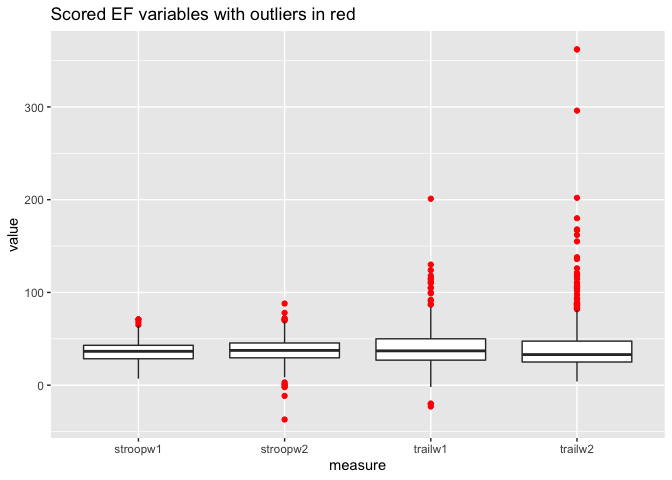

As you can see the scored values have a few outliers. The scores need to be winsorized, meaning the outlier values are kept but are restricted to being +-3 standard deviations, to avoid them influencing measures of central tendency,

``` r
# winsorizing
    # stroop
gadd[stroopw1.est < gadd[,mean(stroopw1.est.pl, na.rm = T)] - gadd[,sd(stroopw1.est.pl, na.rm = T)]*3, # stroop w1 min
   stroopw1.est := (gadd[,mean(stroopw1.est.pl, na.rm = T)] - gadd[,sd(stroopw1.est.pl, na.rm = T)]*3)]
gadd[stroopw1.est > gadd[,mean(stroopw1.est.pl, na.rm = T)] + gadd[,sd(stroopw1.est.pl, na.rm = T)]*3, # stroop w1 min
   stroopw1.est := gadd[,mean(stroopw1.est.pl, na.rm = T)] + gadd[,sd(stroopw1.est.pl, na.rm = T)]*3]

gadd[stroopw2.est < gadd[,mean(stroopw2.est.pl, na.rm = T)] - gadd[,sd(stroopw2.est.pl, na.rm = T)]*3, # stroop w1 min
   stroopw2.est := gadd[,mean(stroopw2.est.pl, na.rm = T)] - gadd[,sd(stroopw2.est.pl, na.rm = T)]*3]
gadd[stroopw2.est > gadd[,mean(stroopw2.est.pl, na.rm = T)] + gadd[,sd(stroopw2.est.pl, na.rm = T)]*3, # stroop w1 min
   stroopw2.est := gadd[,mean(stroopw2.est.pl, na.rm = T)] + gadd[,sd(stroopw2.est.pl, na.rm = T)]*3]

    # trails
gadd[trailw1.dif.simp < gadd[,mean(trailw1.dif.simp.pl, na.rm = T)] - gadd[,sd(trailw1.dif.simp.pl, na.rm = T)]*3, # stroop w1 min
   trailw1.dif.simp := gadd[,mean(trailw1.dif.simp.pl, na.rm = T)] - gadd[,sd(trailw1.dif.simp.pl, na.rm = T)]*3]
gadd[trailw1.dif.simp > gadd[,mean(trailw1.dif.simp.pl, na.rm = T)] + gadd[,sd(trailw1.dif.simp.pl, na.rm = T)]*3, # stroop w1 min
   trailw1.dif.simp := gadd[,mean(trailw1.dif.simp.pl, na.rm = T)] + gadd[,sd(trailw1.dif.simp.pl, na.rm = T)]*3]

gadd[trailw2.dif.simp < gadd[,mean(trailw2.dif.simp.pl, na.rm = T)] - gadd[,sd(trailw2.dif.simp.pl, na.rm = T)]*3, # stroop w1 min
   trailw2.dif.simp := gadd[,mean(trailw2.dif.simp.pl, na.rm = T)] - gadd[,sd(trailw2.dif.simp.pl, na.rm = T)]*3]
gadd[trailw2.dif.simp > gadd[,mean(trailw2.dif.simp.pl, na.rm = T)] + gadd[,sd(trailw2.dif.simp.pl, na.rm = T)]*3, # stroop w1 min
   trailw2.dif.simp := gadd[,mean(trailw2.dif.simp.pl, na.rm = T)] + gadd[,sd(trailw2.dif.simp.pl, na.rm = T)]*3]
```

Now that the scores are winsorized they have a new distribution which is much more normal and the minimum and maximum are much less extreme. Despite there being outliers with the winsorized scores, they cannot be normalized further without changing the outcome of our study.

``` r
dt.EF <- select(gadd, stroopw1 = stroopw1.est, stroopw2 = stroopw2.est, trailw1 = trailw1.dif.simp, trailw2 = trailw2.dif.simp)
#dt.EF <- as.data.table(apply(dt.EF, MARGIN = 2,FUN = as.numeric))
dt.EFlong <- as.data.table(pivot_longer(dt.EF, cols = stroopw1:trailw2, names_to = 'measure', values_to = 'value'))
#dt.EFlong <- as.data.table(gather(dt.EF,key='measure',value='value'))
ggplot(dt.EFlong, aes(x = measure, y = value)) +
  geom_boxplot(outlier.color = 'red') +
  labs(title = 'Winsorized EF scores with outliers in red')
```

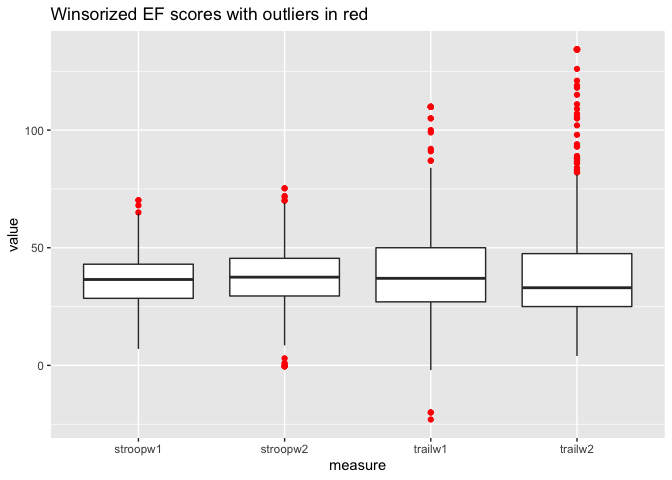

Scoring MH variables
--------------------

The MH variables were scored by the Computerized-Diagnostic Interview Schedule IV (C-DIS-IV) or the Center for Epidemiological Studies Depression (CESD) scale. The C-DIS-IV provides symptom counts and diagnoses of depression and anxiety while the CESD provides a summed score of depressive symptomatology. While visualizing the depression and anxiety symptom counts from the C-DIS-IV something interesting about their distributions was noticed.

``` r
w0 <- as.data.table(gather(select(gadd,
                                     MDDw2, GADw2), 
                              key = "variable", value = "count"))
ggplot(w0, aes(x = count, fill = variable)) +
  geom_density() +
  facet_wrap(~variable) +
  labs(title = "Density plot of MH variables symptom counts including 0")
```

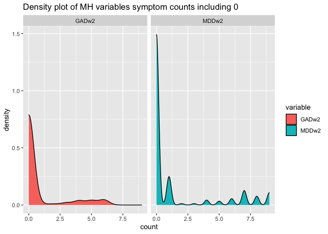

``` r
sans0 <- as.data.table(gather(select(gadd,
                                     MDDw2, GADw2), 
                              key = "variable", value = "count"))
sans0 <- sans0[count != 0]
ggplot(sans0, aes(x = count, fill = variable)) +
  geom_density() +
  facet_wrap(~variable) +
  labs(title = "Density plot of MH variables symptom counts without 0")
```

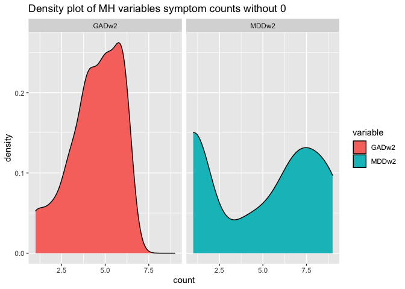

``` r
#ggplot(sans0, aes(x = variable, y = count, fill = variable)) +
#  geom_boxplot() +
#  labs(title = "Boxplot of MH count measures without 0s")
```

It turns out that the sample is bi-modal with most participants have no symptoms or the max number of symptoms. Because of this, depression and anxiety from the C-DIS-IV was converted into a 0,1,2 scale with 0 = no symptoms, 1 = some symptoms but no diagnosis, and 2 = diagnosis.

``` r
gadd <- gadd %>% 
  mutate(GADw2.cat = fifelse(GADw2 > 0, 1, 0),
         MDDw2.cat = fifelse(MDDw2 > 0, 1, 0),
         DYSw2.cat = fifelse(DYSw2 > 0, 1, 0)) %>%
  select(nidaid:GADw2.dx,
         GADw2.cat,
         MDDw2, MDDw2.dx, MDDw2.cat,
         DYSw2, DYSw2.dx, DYSw2.cat,
         everything())
gadd <- as.data.table(gadd)

gadd[GADw2.cat == 1 & GADw2.dx == 1, GADw2.cat := 2]
gadd[MDDw2.cat == 1 & MDDw2.dx == 1, MDDw2.cat := 2]
gadd[DYSw2.cat == 1 & DYSw2.dx == 1, DYSw2.cat := 2]

# binning CESD sum measures where 0 = no symptoms, 1 = some symptoms, 2 = Diagnosable. 
# the cutoff for Dx is 18, found by another paper
# this can be done more robustly in mutate using if, else for future reference
gadd <- gadd %>%
  mutate(cesd.cat.w2 = cesd.sum.w2) %>%
  mutate_at(vars(cesd.cat.w2),
            .funs = function(x) sapply(x, as.numeric)) %>%
  select(nidaid:cesd.sum.w2, cesd.cat.w2,
         everything())
gadd <- as.data.table(gadd)

gadd[cesd.cat.w2 >= 0 & cesd.cat.w2 <= 18, cesd.cat.w2 := 0]
gadd[cesd.cat.w2 > 18, cesd.cat.w2 := 1]
```

Loading in the IQ measure (an EF variable)
------------------------------------------

After working through complicated issues related to the IQ measures, they were scored by a colleague and provided in another data set. Here is the code loading it in and merging it with the relevant data sets.

``` r
gaddw1 <- remove_all_labels(as.data.table(read_por('/Users/kylekent/Desktop/school/Honors thesis research/raw data/Wave1Q.por')))
neurocog.w1 <- remove_all_labels(as.data.table(read_por("~/Desktop/school/Honors thesis research/raw data/neurocog1.por")))
neurocog.w2.agereference <- as.data.table(remove_all_labels(read_por("~/Desktop/school/Honors thesis research/raw data/neurocog2.por")))
neurocog.w2 <- as.data.table(read_csv("~/Desktop/school/Honors thesis research/raw data/neurocog2b.csv"))

colnames(gaddw1) <- tolower(colnames(gaddw1))
colnames(neurocog.w1) <- tolower(colnames(neurocog.w1))

gaddw1 <- as.data.table(gaddw1)
neurocog.w1 <- as.data.table(neurocog.w1)

# concatenating useful variables
Hop.iq <- select(neurocog.w1[!grepl('^...S', nidaid), .SD], nidaid, 
                 w1wivoss, w1wiblss, w1wavoss, w1wablss, w1estiq,
                 w1wivorw, w1wiblrw, w1wavorw, w1wablrw)
Den.iq <- select(gaddw1[!grepl('^...S', nidaid), .SD], nidaid, agew1 = age,
                 wavocab, wablockd, watsvoc, watsblck)
mergedw1 <- merge(Hop.iq, Den.iq, by = 'nidaid')

w2iq <- select(neurocog.w2[!grepl('^...S', nidaid), .SD], nidaid, w2wsblss)
w2iq <- merge(w2iq, select(neurocog.w2.agereference[!grepl('^...S', NIDAID)], NIDAID, agew2 = AGE), by.x = 'nidaid', by.y = 'NIDAID')
merged.iq <- merge(mergedw1, w2iq, by = 'nidaid')

# creating a key for which test was taken at w1 (no w2 because they all got WAIS)
merged.iq[!is.na(w1wivorw) & !is.na(w1wiblrw), iqtestw1 := 'WISC']
merged.iq[!is.na(w1wavorw) & !is.na(w1wavorw), iqtestw1 := 'WAIS']
merged.iq[grepl('^...D', nidaid) & !is.na(wavocab) & !is.na(wablockd), iqtestw1 := 'WAIS']

# coalescing raw scores into single variables
merged.iq[, `:=` (vocrww1 = coalesce(w1wivorw, wavocab),
                 blckrww1 = coalesce(w1wiblrw, wablockd))]

# coalescing the Hop scaled scores 
merged.iq[,`:=` (Hvocssw1 = coalesce(w1wivoss, w1wavoss),
                 Hblckssw1 = coalesce(w1wiblss, w1wablss))]

# creating a new dt of just scored variables
dt.iq <- select(merged.iq, nidaid, agew1, agew2,
                iqtestw1, Hvocssw1, Hblckssw1, watsvoc, watsblck, w1estiq, w2wsblss)

# checking dist and percentage dist of scored variables
quantile(dt.iq$Hvocssw1, probs = c(.02, .16, .5, .84, .98) , na.rm = T) # the scaled scores are definitely m = 10, sd = 3
quantile(dt.iq$Hblckssw1, probs = c(.02, .16, .5, .84, .98) , na.rm = T)

# converting scaled iq values (Hop) to t-scores then combining them with Den t-scores
dt.iq[,`:=` (HvocTw1 = round(((Hvocssw1 - 10)/3)*10+50, 1),
             HblckTw1 = round(((Hblckssw1 - 10)/3)*10+50, 1))]
dt.iq[,`:=` (vocTw1 = coalesce(HvocTw1, as.numeric(watsvoc)),
             blckTw1 = coalesce(HblckTw1, as.numeric(watsblck)))]

# now that we have dt.iq let's remove iq variables from gadd and merge the dts together
gadd <- select(gadd, -iqtestw1:-blckTw2)

gadd <- merge(gadd, 
              select(dt.iq, nidaid, agew1, agew2, iqtestw1, vocTw1, blckTw1, iqw1 = w1estiq, blckTw2 = w2wsblss), 
              by = 'nidaid')
```

Preparing the data to be used in Mplus
--------------------------------------

Mplus is an incredible program used in the social sciences that allows researchers to employ simple to extremely complex statistical analyses and modeling techniques. It helps automate the process of applying advanced methods by providing a user manual with a plethora of examples for different analyses. Not much data management can be done in an Mplus script (a plain .txt file) but rather must be loaded in using a .csv file. No NA or NaN values can be present so they must be converted to '.', a period, or another defined missing value. There can be no character values either. Here is that code:

``` r
gadd_mplus <- copy(gadd)
gadd_mplus$nidaid <- gsub("45-D", "9",gadd_mplus$nidaid)
gadd_mplus$nidaid <- gsub("H", "8",gadd_mplus$nidaid)
gadd_mplus$nidaid <- gsub("S",replacement = "", gadd_mplus$nidaid)

# making sure the hispanic question coerces to numeric properly
gadd_mplus$hispanic <- as.character(gadd_mplus$hispanic)
gadd_mplus$hispanic <- gsub("N", 0, gadd_mplus$hispanic)
gadd_mplus$hispanic <- gsub("Y", 1, gadd_mplus$hispanic)
gadd_mplus$hispanic <- as.numeric(gadd_mplus$hispanic)

# the warnings of NA coercion from the following code stems from the empty spaces in cariq16d-f - cariq20d-f (15 coercions)
# cariq#d does at times contain data but I'm not sure it's relevant for our analysis
gadd_mplus <- sapply(gadd_mplus,as.numeric)
gadd_mplus <- as.data.frame(gadd_mplus)

gadd_mplus <- sapply(gadd_mplus,
                     function(x) replace_na(x,"."))
gadd_mplus <- as.data.frame(gadd_mplus)

gadd_mplus_imp <- as.data.table(select(gadd_mplus,
                                       nsex,
                                       paste0("cariq", 1:20),
                                       cesd.cat.w2,
                                       GADw2.cat, MDDw2.cat,
                                       stroopw1.est, stroopw2.est,
                                       trailw1.dif.simp,
                                       trailw2.dif.simp,
                                       iqtestw1:iqw1, blckTw2))
write_csv(gadd_mplus_imp, "~/Desktop/school/Honors thesis research/useable_data/gadd_mplus_imp_markdown.csv", col_names = FALSE)
```

``` r
gadd_mplus_imp[1:10,]
```

    ##     nsex cariq1 cariq2 cariq3 cariq4 cariq5 cariq6 cariq7 cariq8 cariq9 cariq10
    ##  1:    1      0      0      0      0      1      0      1      0      0       0
    ##  2:    1      0      0      1      0      0      0      0      0      0       0
    ##  3:    1      0      0      0      0      0      0      0      0      0       0
    ##  4:    1      0      0      0      0      0      0      0      0      0       0
    ##  5:    1      0      0      0      0      0      0      0      0      0       0
    ##  6:    1      0      0      0      0      0      0      0      0      0       0
    ##  7:    0      0      0      0      0      0      0      0      0      0       0
    ##  8:    1      0      0      0      0      0      0      0      0      0       0
    ##  9:    0      0      0      0      0      0      0      0      0      0       0
    ## 10:    0      0      0      0      0      0      0      0      0      0       0
    ##     cariq11 cariq12 cariq13 cariq14 cariq15 cariq16 cariq17 cariq18 cariq19
    ##  1:       0       0       0       0       0       0       0       0       0
    ##  2:       0       0       0       0       0       0       0       0       0
    ##  3:       0       0       0       0       0       0       0       0       0
    ##  4:       0       0       0       0       0       0       0       0       0
    ##  5:       0       0       0       0       0       0       0       0       0
    ##  6:       0       0       0       0       0       0       0       .       0
    ##  7:       0       0       0       0       0       0       0       1       0
    ##  8:       0       0       0       0       0       0       0       0       0
    ##  9:       0       0       0       0       0       0       0       0       0
    ## 10:       0       0       0       0       0       0       0       0       0
    ##     cariq20 cesd.cat.w2 GADw2.cat MDDw2.cat stroopw1.est stroopw2.est
    ##  1:       0           1         1         0         34.5            .
    ##  2:       0           0         0         0            .           42
    ##  3:       0           0         0         0         38.5           43
    ##  4:       0           0         0         0           41           37
    ##  5:       0           0         0         1            .          0.5
    ##  6:       0           0         0         0         16.5           24
    ##  7:       1           0         0         0           19         41.5
    ##  8:       0           0         0         0         48.5           72
    ##  9:       0           0         0         0            .         26.5
    ## 10:       0           0         1         2            .           39
    ##     trailw1.dif.simp trailw2.dif.simp iqtestw1 vocTw1 blckTw1 iqw1 blckTw2
    ##  1:               47                .        .     47      47   95       .
    ##  2:                .               27        .     43      62    .      68
    ##  3:               56               80        .     39      31   78      37
    ##  4:               71               34        .     48      51   99      52
    ##  5:                .               42        .     32      44    .      52
    ##  6:  109.87116779776 134.286281628831        .     41      42   86      42
    ##  7:               26               38        .     45      47   93      48
    ##  8:               34               24        .     50      53  102      62
    ##  9:                .               22        .     61      60    .      61
    ## 10:                .               18        .     55      44    .      46

Bayesian estimation in the face of missing data
===============================================

If you haven't noticed already, much of the data presented so far has a high degree of missingness on the EF variables. This is the case because of how the were collected, and study design, at the sites participating in the GADD study before they decided to merge. Because of this, the missingness is purely structural and is Missing At Random (MAR).

Many statistical methods were considered (Multiple Imputation and Full Information Maximum Likelihood) so that we could handle the missing data in a statistically robust way. We discuss those considerations further in the currently unpublished paper of this vignette. For now, I will outline why those methods are inferior to Bayesian estimation in the context of this study. Then, I will outline what Bayesian estimation is and how it was applied to this study.

Why not WLSMV, ML, or MI?
-------------------------

Missing data is inevitable in epidemiological studies so there many statistical methods that handle missing data. Researchers must decide which statistical method will most robustly and efficiently estimate parameter values. Here's a brief overview of those methods and their inadequacies:

-   Weighted Least Squares Mean Variance (WLSMV) is the default estimation technique used in the Structural Equation Modeling software Mplus (Muthén & Muthén, 1987-2017) when categorical variables are present. WLSMV struggles with missing data since in Mplus it can only employ a pairwise deletion method.

-   Maximum Likelihood (ML) is an estimation technique that uses complex integration procedures to use all available data in what's called Full Information Maximum Likelihood (FIML). ML handles missingness extremely well because of this and is one of the best performers for handling missing data. Since ML uses many integrations it is an extremely computationally taxing algorithm and has complications when using categorical data. It also assumes that all data is normal and asymptotic; those assumptions are violated by mediation models as they're inherently non-normally distributed. To compensate, bootstrapping can be done to draw parameter estimates by running a model with random sample sizes and estimating parameters thousands of times. Due to the computational toll of ML, bootstrapping in this study would have taken weeks or possibly months.

-   Multiple Imputation (MI) is another technique that actually uses the same algorithm as Bayesian estimation but uses it to predict and fill in missing values. It uses highly correlated variables to guess the missing values multiple times, then averages those estimates to create a single fully filled in data set. With the imputed data set, simple techniques like WLSMV can be used since there is now no missingness. Yet, MI is complex and difficult to do. It requires having "auxiliary variables", variables that aren't currently being used in the model, that highly correlate with the variables that have missing values. In our study we struggled to find sufficiently correlated variables to predict the missing values and our results were not consistent across imputations or results using other methods.

What is Bayesian estimation and why was it used?
------------------------------------------------

Bayesian estimation is one of the best methods at handling missing data. For a brief overview and application of Bayesian estimation in a Bayesian Structural Equation Model (BSEM) please see Muthén and Asparouhov (2012). In short, Bayesian estimation does not assume normality or an asymptotic distribution, and uses probability distributions to estimate parameter values. Those distributions allow for FIML estimates and can actually be updated using data from prior studies, called prior distributions, to produce more accurate estimates (Muthén & Asparouhov, 2012).

Bayesian estimation creates three probability distributions called the prior, likelihood, and posterior distribution to estimate a parameter. The posterior distribution is a function of the prior and likelihood distributions and is the final distribution that is used to estimate the parameter. The likelihood distribution is representative of only the original data and can be considered the data speaking for themselves. The prior is defined ad hoc by the researcher and elicits an influence over the posterior by defining where the expected parameter estimates should fall.

When the prior is considered to be "non-informative", meaning it was not defined by the researcher, it has a probability for each value of 1. This means each value is considered equally probable so it in no way influences the posterior. If a prior is non-informative then the posterior distribution is the same as the likelihood distribution.

To define an informative prior the researcher must input a distribution derived from another study that is extremely similar to the current one. That prior influences the estimate of the posterior distribution by "telling" the model what the expected values of that estimate are.

Lets consider two examples. Example 1 is a Bayesian estimation using a non-informative prior. Here you have the likelihood distribution (Figure 1A) and the non-informative prior (Figure 2A). The prior elicits no influence over the posterior distribution (Figure 1C) so it is exactly the same as the likelihood.

### Example 1

#### Figure 1A

``` r
# f1a
f1ax <- seq(-10, 10, by = .1)
f1ay <- dnorm(f1ax, 0, 1)
# f1b
f1bx <- seq(-10, 10, by = .1)
f1by <- dnorm(f1bx, 0, Inf)
# f1c 
f1cx <- seq(-10, 10, by = .1)
f1cy <- dnorm(f1cx, 0, 1)

f1 <- as.data.table(cbind(f1ax, f1ay, f1bx, f1by, f1cx, f1cy))

# Figure 1A
ggplot() + 
  geom_line(data = f1, mapping = aes(x = f1ax, y = f1ay, colour = 'red')) +
  labs(title = 'Figure 1A: The likelihood distribution') +
  scale_color_manual(values = c('red'), 
                     name = 'Probability distributions',
                     labels = c('Likelihood')) +
  theme(axis.title.x=element_blank(),
        axis.text.x=element_blank(),
        axis.ticks.x=element_blank(),
        legend.text = element_text())
```

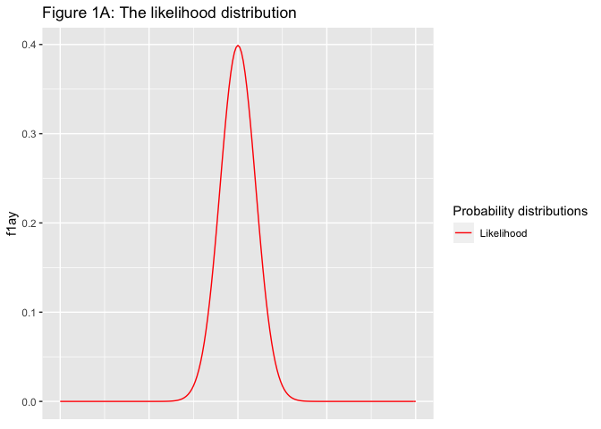

#### Figure 1B

``` r
# Figure 1B
ggplot() + 
  geom_line(data = f1, mapping = aes(x = f1ax, y = f1ay, colour = 'blue')) +
  geom_line(data = f1, mapping = aes(x = f1bx, y = f1by, colour = 'red')) +
  labs(title = 'Figure 1B: The likelihood and non-informative prior distribution') +
  scale_color_manual(values = c('red', 'blue'), 
                     name = 'Probability distributions',
                     labels = c('Likelihood', 'Prior')) +
  theme(axis.title.x=element_blank(),
        axis.text.x=element_blank(),
        axis.ticks.x=element_blank(),
        legend.text = element_text())
```

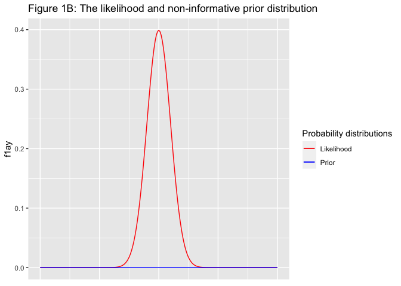

#### Figure 1C

``` r
# Figure 1C
ggplot() + 
  geom_line(data = f1, mapping = aes(x = f1bx, y = f1by, colour = 'purple')) +
  geom_line(data = f1, mapping = aes(x = f1ax, y = f1ay, colour = 'blue')) +
  geom_line(data = f1, mapping = aes(x = f1ax, y = f1ay, colour = 'red')) +
  labs(title = 'Figure 1C: The likelihood, non-informative prior, and posterior distribution') +
  scale_color_manual(values = c('red', 'blue', 'purple'), 
                     name = 'Probability distributions',
                     labels = c('Likelihood', 'Prior', 'Posterior')) +
  theme(axis.title.x=element_blank(),
        axis.text.x=element_blank(),
        axis.ticks.x=element_blank(),
        legend.text = element_text())
```

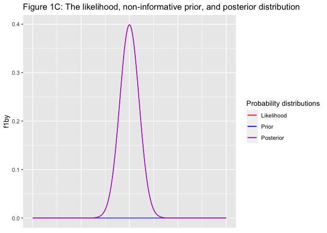

### 

Example 2 is an estimation with an informative prior. Here the likelihood distribution is the same as example 1 (Figure 2A) but the prior is defined (Figure 2B). You can see that the posterior (Figure 2C) is influencing the prior by updating the information in the model.

### Example 2

#### Figure 2A

``` r
# f2a
f2ax <- seq(-10, 10, by = .1)
f2ay <- dnorm(f2ax, 3, 1)
# f2b
f2bx <- seq(-10, 10, by = .1)
f2by <- dnorm(f2bx, -3, 1)
# f1c 
f2cx <- seq(-10, 10, by = .1)
f2cy <- dnorm(f2cx, 0, .50)

f2 <- as.data.table(cbind(f1ax, f1ay, f1bx, f1by, f1cx, f1cy))

# Figure 2A
ggplot() + 
  geom_line(data = f2, mapping = aes(x = f2ax, y = f2ay, colour = 'red')) +
  labs(title = 'Figure 2A: The likelihood distribution') +
  scale_color_manual(values = c('red'), 
                     name = 'Probability distributions',
                     labels = c('Likelihood')) +
  theme(axis.title.x=element_blank(),
        axis.text.x=element_blank(),
        axis.ticks.x=element_blank(),
        legend.text = element_text())
```

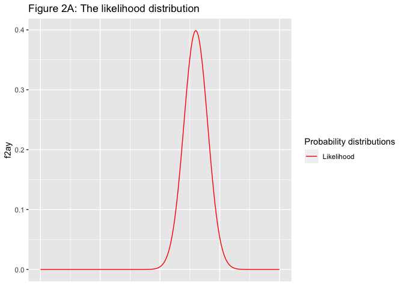

#### Figure 2B

``` r
# Figure 2B
ggplot() + 
  geom_line(data = f2, mapping = aes(x = f2bx, y = f2by, colour = 'red')) +
  geom_line(data = f2, mapping = aes(x = f2ax, y = f2ay, colour = 'blue')) +
  labs(title = 'Figure 2B: The likelihood and informative prior distribution') +
  scale_color_manual(values = c('red', 'blue'), 
                     name = 'Probability distributions',
                     labels = c('Likelihood', 'Prior')) +
  theme(axis.title.x=element_blank(),
        axis.text.x=element_blank(),
        axis.ticks.x=element_blank(),
        legend.text = element_text())
```

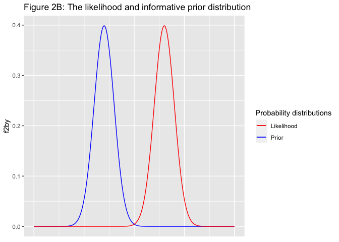

#### Figure 2C

``` r
# Figure 2C
ggplot() + 
  geom_line(data = f2, mapping = aes(x = f2cx, y = f2cy, colour = 'purple')) +
  geom_line(data = f2, mapping = aes(x = f2ax, y = f2ay, colour = 'blue')) +
  geom_line(data = f2, mapping = aes(x = f2bx, y = f2by, colour = 'red')) +
  labs(title = 'Figure 2C: The likelihood, informative prior, and posterior distribution') +
  scale_color_manual(values = c('red', 'purple', 'blue'), 
                     name = 'Probability distributions',
                     labels = c('Likelihood', 'Posterior', 'Prior')) +
  theme(axis.title.x=element_blank(),
        axis.text.x=element_blank(),
        axis.ticks.x=element_blank(),
        legend.text = element_text())
```

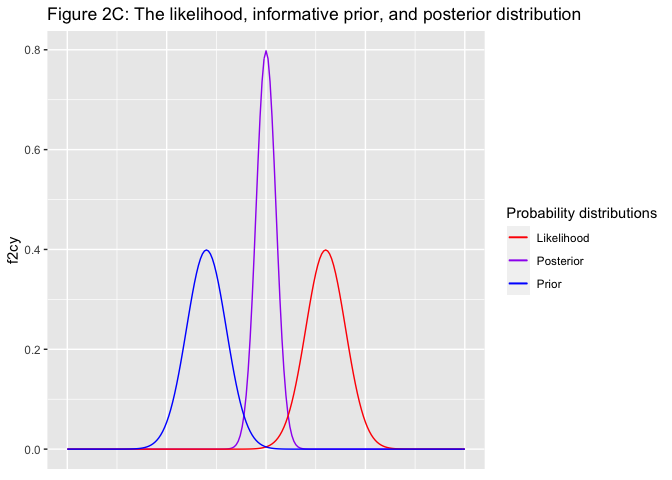

### 

The following section will outline my unsuccessful attempt at producing prior distributions.

### Attempting to define a weakly-informative prior for EF variables

This subsection outlines how I attempted to define weakly-informative priors for the IQ, Stroop, and Trails measures. It was ultimately unsuccessful for reasons that will be outlined shortly, but it highlights how Bayesian estimation could have greatly improved this study's power.

#### What is a weakly-informative prior?

Firstly we should define what a weakly-informative prior is. As explained before, priors are derived from previous studies. They tend to influence the likelihood distributions (of the current data) in a way that does not allow the current data to fully express itself. That raises a concern that the results of the study could be too greatly influenced by a past study. A simple work around is to define a prior that "weakly informs" the model by not being overly restrictive. Weakly informative priors can be defined many was but is as simple multiplying the variance of the distribution by a factor of 4. This method means for a normal distribution that little influence will be exerted over any data unless they are extreme values.

#### Deriving the priors

Weakly informative priors have the benefit of restricting a posterior distribution to a reasonable range based on information we already know. That information theoretically comes from an extremely similar study with a similar population. This is done by conducting an analysis and taking the subsequent posterior distributions for each parameter. Those posteriors are then used as priors in the new analyses. Luckily for us, we did not use a portion of the subjects in our study do to their cohort not being given the child abuse and neglect measure. That cohort (N ~= 450) was used to replicate the Confirmatory Factor Analysis done for the EF variables in the main study. The posterior distribution of the paths from each variable onto the latent EF factor was used to define the Stroop and Trails priors.

The following uses a few r packages to interact with Mplus to create figures displaying the measures of central tenancy of the parameter's posterior distribution needed to define a prior.

##### Trails wave 1

``` r
source('~/Desktop/school/Honors thesis research/r_scripts/mplus.R')
library(MplusAutomation)
library(rhdf5)

# posterior of SD trails w1
mplus.plot.bayesian.distribution('~/Desktop/school/Honors thesis research/mplus_scripts/take2/EFA-CFA/CFA_SD_EFw2.gh5', 5)
```

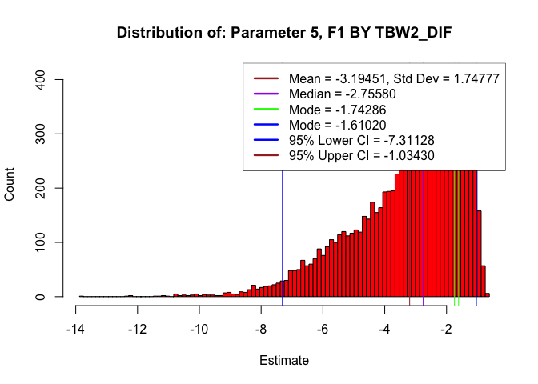

##### Stroop wave 1

``` r
# posterior of SD trails w1
mplus.plot.bayesian.distribution('~/Desktop/school/Honors thesis research/mplus_scripts/take2/EFA-CFA/CFA_SD_EFw2.gh5', 4)
```

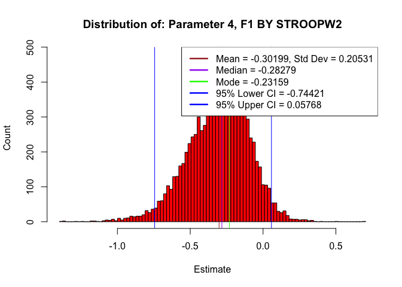

#### 

When the distribution is normal then defining the prior is as simple as taking the mean /*m**u* and variance /*s**i**g**m**a*<sup>2</sup> and inputing them into the distribution *N*(*μ*, *σ*<sup>2</sup>). For the prior to be weakly-informative, the variance should be about four times greater as a rule of thumb. As you can see in the figures above, the Stroop distribution is relatively normal and could be defined using the above equation. Yet Trails is not normally distributed but is rather an Inverse Gamma (IG) distribution. The equation to define an informative IG prior is *I**G*(*α*, *β*) where $\\alpha = 2 + \\frac{\\mu^2}{\\sigma^2}$ and $\\beta = \\mu + \\frac{\\mu^3}{\\sigma^2}$. The real struggle here comes from defining a weakly-informative prior to increase the variance by a factor of 4.

The kind people at Mplus recommended trying to keep the mode as similar as possible while modifying *α* and *β* so that the scale of the distribution was much larger. Since we can consider the *M**o**d**e* and *σ*<sup>2</sup>(4) as fixed parameters, then we can increase the scale of the distribution by by solving for *α* and *β* using the following set of equations.
$$Mode = \\frac{\\beta}{(\\alpha + 1)}$$
 and
$$\\sigma^2 = \\frac{\\beta^2}{(\\alpha-1)^2(\\alpha-2)}$$
 Now get the variance *σ*<sup>2</sup> multiplied by 4 and solving for *α* using
$$\\sigma^2(4) = \\frac{Mode^2(\\alpha + 1)^2}{(\\alpha - 1)^2(\\alpha - 2)^2}$$
 then plugging in *α* to solve for *β* with
*β* = *M**o**d**e*(*α* + 1)

The previous equations were used to define priors but a few complications made it difficult to follow through due to concerns of improperly defining them. Firstly, the priors for the EF parameters input into the model were resulting in extreme values of those parameters' posterior distributions. Secondly, the IG prior equations would make it difficult to run a sensitivity analysis post-hoc to confirm they were not exerting undue influence over the model. Instead, non-informative priors were used to avoid influencing the results of the model in a non-robust way.

Results
=======

The measurement model
---------------------

A set of Exploratory and Confirmatory Factor Analyses (EFA; CFA) were conducted to derive latent factors used to build a measurement model for our Bayesian Structural Equation Model (BSEM). Structural Equation Models combine similar variables that are measuring a single construct, or latent factor (e.g., a questionnaire operationalizing depression). This combination takes into account the variances between each variable, allowing for a better fit of the model and reducing the standard errors of subsequent model parameters. The EFAs and CFAs will not be outlined in-depth here since they are thoroughly discussed in my honors thesis (Kent, 2020).

Instead, what's important to know is that the EF variables (Performance-IQ, Stroop, and Trails) at each wave loaded onto a single latent EF factor at each wave. The same was true for the depression and anxiety scales onto a MH variable. The only variable that was not simply loaded onto a single factor was the CAN variables. Part of my hypotheses required testing different CAN measurement models and the EFA and CFA informed us of two factor structures. The first was a single latent factor where the sub types of CAN (neglect, psychological, physical, and sexual abuse) were loaded onto a single factor. We call this Model 1. The second model (Model 2) was nearly identical except the CAN sub types were broken up into four factors.

### 

#### Model 1

``` r
knitr::include_graphics('/Users/kylekent/Desktop/school/Honors thesis research/figures_tables/defense_figures/HT_Model_1_measurment.jpg') 
```


<p class="caption">
Model 1 measurement model. You can see the latent factors that load onto the respective variables. CARIq is the Child Abuse and Neglect (CAN) questionnaire. P-IQ stands for Performance IQ. EF means Executive Functions while w1 and w2 designates wave 1 and 2. MHw2 is Mental Health at wave 2 loading onto measures of Major Depressive Disorder (MDD), Generalized Anxiety Disorder (GAD), and the Center for Epidemiological Studies Depression scale (CES-D). This model does not display included covariates of sex and age.
</p>

#### Model 2

``` r
knitr::include_graphics('/Users/kylekent/Desktop/school/Honors thesis research/figures_tables/defense_figures/HT_Model_2_measurment.jpg')
```


<p class="caption">
Model 2 measurement model. You can see the latent factors that load onto the respective variables. The CAN measures are broken up into the four subtypes of Neglect (NEG), Psychological (PSYC), Physical (PHYS), and Sexual abuse. The CAN types loaded onto their respective CARIq variables which is not shown. The arrows connecting the types depicts how they were allowed to correlate in the model. P-IQ stands for Performance IQ. EF means Executive Functions while w1 and w2 designates wave 1 and 2. MHw2 is Mental Health at wave 2 loading onto measures of Major Depressive Disorder (MDD), Generalized Anxiety Disorder (GAD), and the Center for Epidemiological Studies Depression scale (CES-D). This model does not display included covariates of sex and age.
</p>

### 

The mediation
-------------

After the measurement model was defined the next step was to conduct a mediation analysis. A mediation is a more complex regression that integrates the weight that one independent variable has over another independent variable in the overall relationship to the dependent variable. A mediation model is theoretically causal as one variable, x, influences y. The x variable also influences a mediator variable, m, which influences y. Being able to control for the relationship of x to m to y allows us to understand the causal mechanisms through which x influences y.

In applying a mediation model to my study we see that x is CAN, y is MH, and m is EF. The idea is that if experiencing CAN lowers EF, and lower EF is related to worse MH, then that relationship may contribute to how CAN worsens MH. Here is a visual representation of the mediation model.

### 

#### Model 1

``` r
knitr::include_graphics('/Users/kylekent/Desktop/school/Honors thesis research/figures_tables/defense_figures/HT_Model_1_figure_blank.jpg') 
```


<p class="caption">
Model 1 mediation
</p>

#### Model 2

``` r
knitr::include_graphics('/Users/kylekent/Desktop/school/Honors thesis research/figures_tables/defense_figures/HT_Model_2_figure_blank.jpg') 
```


<p class="caption">
Model 1 measurement model. You can see the latent factors that load onto the respective variables. CARIq is the Child Abuse and Neglect (CAN) questionnaire. P-IQ stands for Performance IQ. EF means Executive Functions while w1 and w2 designates wave 1 and 2. MHw2 is Mental Health at wave 2 loading onto measures of Major Depressive Disorder (MDD), Generalized Anxiety Disorder (GAD), and the Center for Epidemiological Studies Depression scale (CES-D). This model does not display included covariates of sex and age.
</p>

### 

The outputs
-----------

The following figures and tables for Model 1 and 2 will outline the regression path coefficients (and credibility intervals) graphically and tabularly with the mediation results presented in a table. Typically with a frequentist statistics approach, a researcher looks for the *p-value* (or the confidence intervals) to decide significance. In Bayesian estimation, the equivalent of a frequentist *p-value* is the Posterior Predictive *p-value* (PP *p*) which is shown in the table. The PP *p* is based on the credibility intervals of the parameter estimate which is also given.

### Model 1

#### Figure

``` r
knitr::include_graphics('/Users/kylekent/Desktop/school/Honors thesis research/figures_tables/HT_Model_1_figure.jpg') 
```


#### Regression coefficient table

``` r
knitr::include_graphics('/Users/kylekent/Desktop/school/Honors thesis research/figures_tables/HT_Model_1_table_reg.jpg')
```


#### Mediation table

``` r
knitr::include_graphics('/Users/kylekent/Desktop/school/Honors thesis research/figures_tables/HT_Model_1_table_med.jpg')
```


### 

As you can see in the figure, the path from CAN to MHw2 and EFw1 to EFw2 is significant. Even though the relationship between CAN to EFw1 and EFw2 to MHw2 are not significant, they are trending. This highlights that there may in-fact be a relationship between CAN, EF, and MHw2. We may not have had enough power in this study to detect that relationship due to the missing data.

### Model 2

#### Figure

``` r
knitr::include_graphics('/Users/kylekent/Desktop/school/Honors thesis research/figures_tables/HT_Model_2_figure.jpg') 
```


#### Regression coefficient table

``` r
knitr::include_graphics('/Users/kylekent/Desktop/school/Honors thesis research/figures_tables/HT_Model_2_table_reg.jpg')
```


#### Mediation table

``` r
knitr::include_graphics('/Users/kylekent/Desktop/school/Honors thesis research/figures_tables/HT_Model_2_table_med.jpg')
```


### 

The figure and tables for Model 2 become more complex due to an increase in the number of parameters, but don't let that phase you. We interpret the model the same way as Model 1. The big difference in the results of Model 1 and Model 2 that we see is that the CAN sub types have no significant relationships to any of the other variables. This is odd since the overall CAN factor was highly significant with MHw2. It should be noted that the CAN types were allowed to correlate in this model and their correlations are extremely substantial. It's possible that the types are so similar that their correlations are obscuring their capacity to predict dependent variables. To test this, a few post-hoc analyses were done.

Post-Hoc analyses
-----------------

To understand why the individual CAN sub types did not significantly predict MHw2 in Model 2, two step-wise regression analyses were conducted. In the first analysis, only one CAN type was included in Model 2 while all others were excluded. Here's an example of the analysis we conducted looking at Neglect's prediction of MH.

``` r
knitr::include_graphics('/Users/kylekent/Desktop/school/Honors thesis research/figures_tables/defense_figures/HT_Model_2_Neg_only.jpg')
```


The purpose of the first post-hoc analysis was to see if any of the sub types, in isolation, predicted MH. What we found was that each abuse and neglect sub type did in fact significantly predict MH. Here's a table of those results. Note that we included a measure of explained variance of MHw2, R**<sup>2</sup>, which is relevant for the following analysis.

``` r
knitr::include_graphics('/Users/kylekent/Desktop/school/Honors thesis research/figures_tables/HT_PostHoc_individual.jpg')
```


In the second analysis, only one of the CAN types was excluded while three were kept. The purpose of this analysis was to uncover the amount of explained variance of each CAN type and see if excluding that factor significantly worsened model fit. The change in explained variance of MHw2 for Model 2 and the model with one variable excluded was considered to be the amount of explained variance for that excluded variable. We also applied model constraints using a Wald *χ*<sup>2</sup> test to see if excluding that variable worsened model fit. The following example shows only neglect being excluded.

``` r
knitr::include_graphics('/Users/kylekent/Desktop/school/Honors thesis research/figures_tables/defense_figures/HT_Model_2_r2_example.jpg')
```


We found that, at most, each individual sub type only accounted for about 2% of the variance of MH. None of the model restraints applied in the Wald *χ*<sup>2</sup> test worsened model fit.

``` r
knitr::include_graphics('/Users/kylekent/Desktop/school/Honors thesis research/figures_tables/HT_PostHoc_subtracting.jpg')
```


Discussion and Conclusion
=========================

Discussion
----------

The outcome of this study confirm to us that CAN and adult mental health are strongly related. This is not a novel finding, but we uncovered that when modeling CAN in a sample with a lot of trauma, a factor analytic model struggles to handle intercorrelations between CAN types. Although separating the CAN sub types as different factors is important to understand CAN's relationship to adult outcomes, the co-occurring nature of different types of abuse validates factor models using only one CAN factor. To this end, it may be beneficial to shift away from factor analytic models due to its inadequacies highlighted in this study. Instead, person-centered approaches like Latent Class Analysis should be explored as a new method to model CAN.

Despite the mediation model showing that EFs did not partial the relationship of CAN to adult MH, we can conclude that these three concepts are related. They all had trending relationships which supports our mediation model and further research into it. This is exemplified by the fact that missingness on the EF variables may have limited our power to detect a relationship. Future research with more complete data sets should be spurred on by our findings.

Conclusion
----------

At the end of the day, the results of my study go well beyond *p-values*, distributions, and their interpretations. My time working on this project helped me grow over the past year in more ways than one. It was an honor and a pleasure to be able to work with distinguished researchers like my incredible adviser, Dr. Michael Stallings. Without his guidance and encouragement, I would not have known where to start this project. He helped me break into the academic field with my first study which inadvertently brought out of me a passion for coding, statistics, and data. I should also commend my other adviser, Flux MC, because without him my skills in R would be nothing like what they are now.

Overall this project has been a lot of fun despite the stress and struggle that is academia. It taught me how to be self-sufficient by teaching myself Bayesian estimation; I learned many new skills for coding and found a passion for; most importantly I learned how much I love working with individuals in this field.

Thank you for taking the time to review this file paper.

References
==========

Muthén, L.K., Muthén, B.O. (1998-2017). Mplus user's guide (8th ed.) Los Angeles, CA: Muthén & Muthén.

Muthén, B., & Asparouhov, T. (2012). Bayesian structural equation modeling: A more flexible representation of substantive | theory. Psychological Methods, 17(3), 313–335. <http://dx.doi.org/10.1037/a0026802>

Kent, K.R. (2020). The relationship of adult mental health and potentially traumatic childhood events as mediated through | changes in executive functions \[Unpublished (embargoed) honors thesis\]. University of Colorado Boulder.
